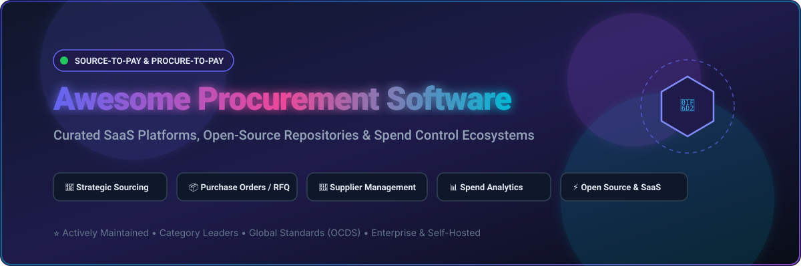
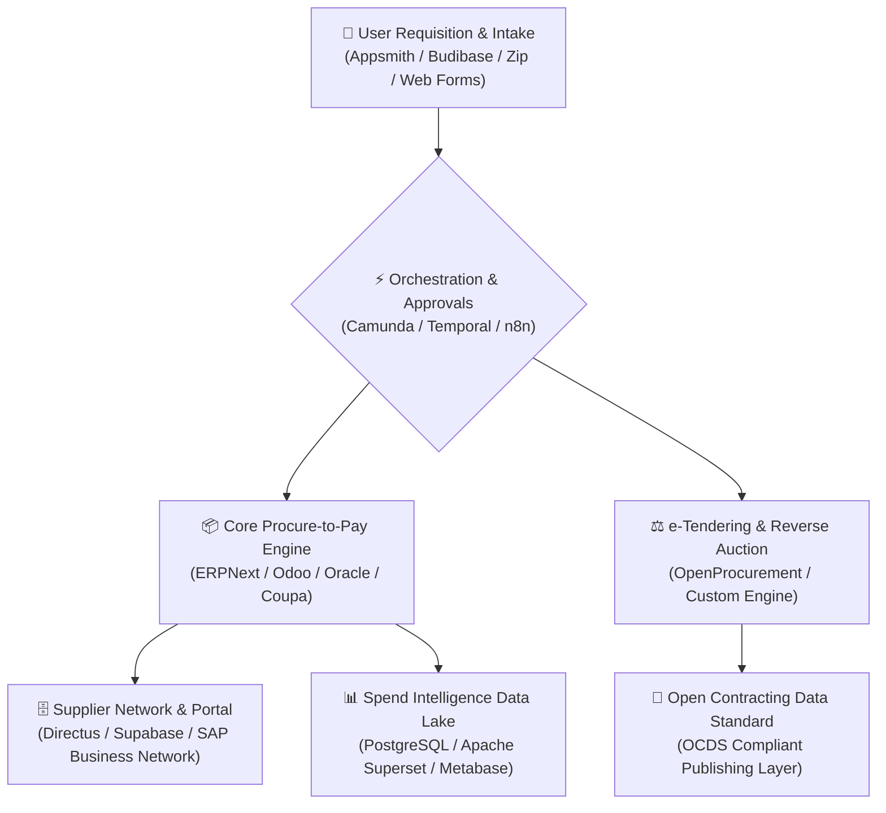

# 🛒 Awesome Procurement Software

  

### Curated List of SaaS Platforms & Open-Source Projects for Source-to-Pay, Procure-to-Pay, Supplier Management, RFQs, Purchase Orders & Spend Control

  
  
  
  
  

  <b>Discover enterprise SaaS leaders, self-hosted procurement ERPs, automated intake-to-procure tools, RFQ & bidding engines, and open procurement data standards.</b>

---

## 📑 Table of Contents

- [🌐 Market Overview & Industry Dynamics](#-market-overview--industry-dynamics)
- [☁️ SaaS / Hosted Platforms](#️-saas--hosted-platforms)
- [💻 Open-Source GitHub Projects](#-open-source-github-projects)
  - [🏢 Full Procure-to-Pay & ERP Suites](#-full-procure-to-pay--erp-suites)
  - [⚖️ Dedicated e-Procurement & Tendering Engines](#️-dedicated-e-procurement--tendering-engines)
  - [⚡ Workflow Automation & BPM Engines](#-workflow-automation--bpm-engines)
  - [🗄️ Low-Code / Database & Supplier Portals](#️-low-code--database--supplier-portals)
  - [📊 Spend Analytics & Procurement BI](#-spend-analytics--procurement-bi)
  - [📐 Procurement Data Standards & Specifications](#-procurement-data-standards--specifications)
- [🏗️ Architectural Reference Frameworks](#️-architectural-reference-frameworks)
- [🤝 How to Contribute](#-how-to-contribute)
- [📈 Star History](#-star-history)
- [📄 Disclaimer](#-disclaimer)

---

## 🌐 Market Overview & Industry Dynamics

> **📊 Global Market Size & Structure:**  
> The global procurement software market is valued at approximately **$9.8B – $11.4B** (projected to reach **$20.7B – $27.9B by 2033–2035** at a **9.7%–13.6% CAGR**). The sector is **moderately concentrated**—dominated at the top tier by global enterprise suites (Oracle, SAP Ariba, Coupa, ServiceNow) while remaining competitive and fragmented across specialized mid-market intake-to-procure platforms, AP automation solutions, and open-source self-hosted ecosystems.

---

## ☁️ SaaS / Hosted Platforms

The table below is sorted in **descending order by company valuation / market capitalization / revenue tier**:

| Platform | Company Valuation / Revenue Scale | Description | Starting Pricing | Free Tier / Free Trial Limits |
| :--- | :--- | :--- | :--- | :--- |
| **[Oracle Procurement Cloud](https://www.oracle.com/erp/procurement/)** | **~$400B+ Market Cap** (Oracle Enterprise) | Enterprise procurement suite integrated with Oracle's cloud ERP ecosystem for strategic sourcing, contracts, supplier management, and procure-to-pay operations. | Starts at ~$225–$500/user/month for full procurement users (~$50–$75/user/month for self-service requesters) | No free tier for enterprise procurement ERP apps; trial access is limited to Oracle Cloud sales evaluation sandbox / proof-of-concept environments |
| **[SAP Ariba](https://www.ariba.com/)** | **~$200B+ Market Cap** (SAP Parent Scale) | Large-scale source-to-pay platform supporting strategic sourcing, supplier networks, procurement, contracts, invoicing, and enterprise spend management. | Free for standard supplier accounts; Enterprise buyer modules start from ~$5,000–$25,000/user/year or ~$80,000+/year for core packages | Free forever for standard supplier account on SAP Business Network (unlimited basic document exchange); Buyer suite provides limited guided interactive product tours |
| **[ServiceNow Source-to-Pay Operations](https://www.servicenow.com/products/source-to-pay.html)** | **~$190B+ Market Cap** (ServiceNow Inc.) | Enterprise workflow platform capabilities that centralize procurement intake, approvals, service purchasing, supplier case management, and ERP orchestration. | Custom enterprise package based on ServiceNow IT/Procurement workflow licenses (typically $10,000+/year) | No free trial for Source-to-Pay Operations module; developer sandbox instances provide general platform workflow evaluation |
| **[Coupa](https://www.coupa.com/)** | **~$8.0B Valuation** (Acquired by Thoma Bravo) | Enterprise spend management and procurement platform covering sourcing, supplier management, procurement, invoicing, expenses, payments, and spend intelligence. | Free for registered supplier accounts; Enterprise buyer spend management starts from ~$2,500/month (billed annually, tiered by module/spend volume) | Free forever for basic supplier portal (order management & e-invoicing); Coupa Advanced supplier tier has a 30-day free trial; Buyer suite is demo-only (no self-serve free trial) |
| **[Zip](https://ziphq.com/)** | **~$2.2B Valuation** (Valued at $2.2B Series D) | Intake-to-procure platform designed to centralize purchasing requests, multi-department approvals, supplier onboarding, and procurement workflows. | Mid-market and enterprise custom contracts; typically starting from ~$25,000+/year flat contract | No free tier or self-serve trial; evaluation via structured company demo and workflow discovery |
| **[Basware](https://www.basware.com/)** | **~$700M Valuation** (Acquired by Consortium) | Procure-to-pay and accounts-payable automation platform with deep capabilities around e-invoicing, purchasing, supplier connectivity, and global compliance. | Custom volume-based subscription; entry modular AP & purchasing packages start from ~$1,250+/month | No free tier; prospective organizations evaluate via Basware Business Case Calculator and guided proof-of-concept demos |
| **[GEP SMART](https://www.gep.com/software)** | **~$600M+ Annual Revenue** (GEP Global) | AI-enabled procurement and supply-chain platform covering sourcing, procurement, supplier management, spend analysis, and procure-to-pay workflows. | Enterprise custom quote; annual subscription packages start from ~$30,000–$50,000+/year | No free tier; evaluation available via scheduled live product demo |
| **[Ivalua](https://www.ivalua.com/)** | **~$500M+ Valuation** / **~$180M ARR** | Unified source-to-pay suite focused on supplier management, strategic sourcing, procurement, contracts, invoicing, and enterprise spend control. | Enterprise custom quote; benchmark deployments typically start from ~$150,000/year | No free tier; evaluation is limited to personalized guided demo sessions |
| **[JAGGAER](https://www.jaggaer.com/)** | **~$500M+ Valuation** (Acquired by Vista Equity) | Source-to-pay and procurement platform supporting direct and indirect sourcing, supplier management, contracts, procurement automation, and spend analytics. | Enterprise custom quote; subscription tiers based on modules and spend volume | No free tier or trial; platform evaluation is available through live guided demos |
| **[Medius](https://www.medius.com/)** | **~$250M+ Valuation** (Marlin Equity Partners) | Procurement and spend-management platform focused on purchasing workflows, invoice automation, supplier management, and financial control. | AP Essentials starting from ~$2,499/month (annual agreement, includes unlimited users) | No free tier; demo and structured pilot evaluation available upon request |
| **[Corcentric Procurement Solutions](https://www.corcentric.com/)** | **~$200M+ Annual Revenue** | Source-to-pay and procurement technology supporting sourcing, purchasing, supplier management, invoicing, and financial operations. | Custom quote-based annual subscription based on procurement spend volume and active functional modules | No free tier; access and evaluation through scheduled solutions architecture demos |
| **[Proactis](https://www.proactis.com/)** | **~$100M Valuation** (Acquired by Pollen Street) | Source-to-pay and spend-management platform supporting procurement, supplier management, sourcing, purchasing, and financial control. | Enterprise quote-based pricing; entry tiers typically benchmarked around $500+/month based on selected functional modules | No free tier or self-serve trial; product evaluation conducted via vendor-led demonstration |
| **[Procurify](https://www.procurify.com/)** | **~$70M+ Raised** / Mid-Market Scale | Cloud procurement and spend-management platform focused on purchasing requests, approvals, purchase orders, budgets, and purchasing visibility. | Starts at ~$1,000–$2,000/month for mid-market purchasing core packages (includes unlimited basic requesters) | No free tier or self-serve free trial; access provided via tailored interactive demo |
| **[Precoro](https://precoro.com/)** | **~$20M–$50M Valuation Range** | Procurement automation platform supporting purchase requests, approval workflows, purchase orders, budgets, supplier records, and spend reporting. | Core plan starts at $499/month (billed annually); Automation plan starts at $999/month | 14-day free trial with full access to core procurement and workflow features (no credit card required) |
| **[Gorilla Expense](https://www.gorillaexpense.com/)** | **~$10M–$20M Valuation Range** | Spend and purchasing management tools that support employee purchasing controls, approvals, and procurement-related financial workflows. | Starts at $1,750 one-time fee for on-premise or flexible user subscription / report pricing starting around $5–$10/user/month | 30-day free trial available upon request covering up to standard report volumes and mobile receipts |
| **[Tradogram](https://tradogram.com/)** | **~$5M–$15M Valuation Range** | Procurement management platform offering requisitions, approvals, supplier management, purchase orders, inventory-related purchasing, and spend control. | Free Plan: $0/month; Essentials paid plan starts at $99/month (or $79/month billed annually) | Free forever tier available: limited to 1 user and up to 10 purchase orders per month with unlimited items and suppliers |

---

## 💻 Open-Source GitHub Projects

The repositories below are organized by category and sorted in **descending order by GitHub star count** with live star badges linking to their stargazers page.

### 🏢 Full Procure-to-Pay & ERP Suites

| Repository | Github_Stars | Description | Focus Areas |
| :--- | :--- | :--- | :--- |
| **[odoo/odoo](https://github.com/odoo/odoo)** |  | Major open-source business suite with purchasing, RFQs, vendor management, POs, inventory integration, and automated 3-way matching. | P2P, Purchase Orders, RFQ, Invoicing |
| **[frappe/erpnext](https://github.com/frappe/erpnext)** |  | Modern full-stack open-source ERP with end-to-end procurement: material requests, RFQs, supplier quotations, purchase orders, receipts, and budgeting. | Source-to-Pay, Supplier Quotation, POs |
| **[dolibarr/dolibarr](https://github.com/dolibarr/dolibarr)** |  | Web-based ERP/CRM software providing supplier price lists, purchase proposals, purchase orders, stock dispatching, and vendor invoicing. | Supplier Orders, Requisitions, Invoicing |
| **[apache/ofbiz](https://github.com/apache/ofbiz)** |  | Enterprise automation framework with comprehensive supply-chain management, requisitions, purchase orders, agreement terms, and accounting. | Enterprise Purchasing, Supply Chain |
| **[axelor/axelor-open-suite](https://github.com/axelor/axelor-open-suite)** |  | Modular business suite with BPM-driven purchasing, multi-level approval matrices, supplier contracts, RFQs, and purchase order tracking. | BPM Approvals, RFQ, Supplier Contracts |
| **[idempiere/idempiere](https://github.com/idempiere/idempiere)** |  | Community-driven OSGi-based enterprise ERP supporting requisition management, matching rules, vendor tracking, and purchasing workflows. | Enterprise P2P, Requisitions, POs |
| **[metasfresh/metasfresh](https://github.com/metasfresh/metasfresh)** |  | Scalable open-source ERP built for high-throughput procurement, supplier dispatching, automated purchase orders, and logistics sync. | High-Volume Purchasing, Logistics |
| **[tryton/tryton](https://github.com/tryton/tryton)** |  | Modular 3-tier business framework featuring dedicated purchase, purchase-request, supplier lead time, and invoice verification modules. | Modular Purchasing, Purchase Requests |
| **[adempiere/adempiere](https://github.com/adempiere/adempiere)** |  | Mature open-source ERP system with procurement workflows, vendor price lists, purchase requisitions, and inventory-linked buying. | Vendor Price Lists, POs, Accounting |
| **[OCA/purchase-workflow](https://github.com/OCA/purchase-workflow)** |  | Community-maintained extensions for Odoo that add purchase tiers, multi-level approvals, requisitions, and advanced vendor quotation logic. | Odoo Addons, Multi-tier Approvals |
| **[flectra-hq/flectra](https://github.com/flectra-hq/flectra)** |  | Open-source business management system featuring purchasing management, RFQs, vendor rating, and approval workflows. | RFQs, Supplier Ratings, POs |
| **[viennaadvantage/viennaadvantage](https://github.com/viennaadvantage/viennaadvantage)** |  | Enterprise open-source ERP & CRM suite with procurement, material management, purchase requisitions, and contract tracking. | Material Requisitions, Procurement |
| **[openbravo/openbravo](https://github.com/openbravo/openbravo)** |  | Enterprise commerce and ERP platform historically featuring retail purchasing, supplier management, and replenishment planning. | Retail Procurement, Replenishment |
| **[nexedi/erp5](https://github.com/nexedi/erp5)** |  | High-flexibility Python/Zope ERP covering complex procurement pipelines, government tendering, trade models, and inventory supply chains. | Custom Pipelines, Trade Models |
| **[OpenXE-org/OpenXE](https://github.com/OpenXE-org/OpenXE)** |  | Open-source enterprise ERP (derived from Xentral) supporting purchasing, supplier orders, inventory replenishment, and invoice auditing. | Supplier Orders, Inventory Replenishment |

---

### ⚖️ Dedicated e-Procurement & Tendering Engines

| Repository | Stars | Description | Focus Areas |
| :--- | :--- | :--- | :--- |
| **[openprocurement/openprocurement.api](https://github.com/openprocurement/openprocurement.api)** |  | Core datastore and API toolkit powering large-scale e-procurement, tender publication, transparent bidding, and reverse auctions (ProZorro ecosystem). | Electronic Tenders, Bidding, Auctions |
| **[openprocurement/openprocurement.tender.core](https://github.com/openprocurement/openprocurement.tender.core)** |  | Business logic for managing public and commercial tendering procedures, competitive bidding, eligibility criteria, and awards. | Tender Lifecycle, Award Automation |
| **[openprocurement/openprocurement.auction](https://github.com/openprocurement/openprocurement.auction)** |  | Real-time electronic auction module supporting english reverse auctions and multi-round bidding in public and private procurement. | Real-time Reverse Auctions, Bidding |
| **[openprocurement/openprocurement.contracting.core](https://github.com/openprocurement/openprocurement.contracting.core)** |  | Contract lifecycle management module for drafting, publishing, tracking amendments, and monitoring contract implementation. | Contract Management, Amendments |
| **[ishandutta2007/VendorBridge](https://github.com/ishandutta2007/VendorBridge)** |  | Open-source full-stack procurement workflow project supporting vendors, RFQs, quotations, approvals, purchase orders, invoices, and spend reporting. | Full-stack P2P, RFQ, Vendor Portals |

---

### ⚡ Workflow Automation & BPM Engines

*Use these workflow engines to orchestrate complex multi-step procurement approvals, intake-to-procure routing, budget authorizations, and ERP synchronization.*

| Repository | Stars | Description | Focus Areas |
| :--- | :--- | :--- | :--- |
| **[n8n-io/n8n](https://github.com/n8n-io/n8n)** |  | Fair-code workflow automation tool connecting procurement systems with ERPs, Slack/Teams approval bots, email parser RFQs, and databases. | Integration Automation, Approval Bots |
| **[temporalio/temporal](https://github.com/temporalio/temporal)** |  | Durable execution system designed for reliable, long-running procurement transactions, asynchronous supplier responses, and payout pipelines. | Resilient S2P Workflows, Orchestration |
| **[node-red/node-red](https://github.com/node-red/node-red)** |  | Low-code event-driven programming tool for wiring procurement webhooks, IoT warehouse goods receipt triggers, and notification pipelines. | Event-driven Triggers, Webhooks |
| **[camunda/camunda](https://github.com/camunda/camunda)** |  | Enterprise-grade BPMN & DMN engine for modeling complex purchasing approval matrices, vendor onboarding, exception handling, and compliance. | BPMN Approvals, DMN Decision Tables |
| **[flowable/flowable-engine](https://github.com/flowable/flowable-engine)** |  | Compact and highly efficient BPMN/CMMN process engine powering purchase requisition routing, case management, and supplier task workflows. | Requisition Routing, Dynamic Cases |
| **[bonitasoft/bonita-engine](https://github.com/bonitasoft/bonita-engine)** |  | Business process automation engine and application platform for building custom purchasing portals and approval chains. | Purchasing Portals, Process Apps |
| **[kiegroup/jbpm](https://github.com/kiegroup/jbpm)** |  | Java-based business process management suite for orchestrating corporate procurement rules, automated approval routing, and policy checks. | Rule-based Routing, Policy Validation |

---

### 🗄️ Low-Code / Database & Supplier Portals

*Deploy these platforms to quickly create internal purchasing forms, lightweight supplier registries, quotation compare tables, and vendor intake portals.*

| Repository | Stars | Description | Focus Areas |
| :--- | :--- | :--- | :--- |
| **[supabase/supabase](https://github.com/supabase/supabase)** |  | Open-source Firebase alternative (Postgres + Auth + Realtime + Storage) ideal for backend architectures of custom procurement web apps. | Procurement DB Backend, Realtime Events |
| **[appsmithorg/appsmith](https://github.com/appsmithorg/appsmith)** |  | Low-code framework to build internal procurement tools, PO approval dashboards, supplier directory consoles, and invoice audit views. | Internal Admin Consoles, PO Dashboards |
| **[directus/directus](https://github.com/directus/directus)** |  | Modular data platform and headless CMS wrapping SQL databases to build custom vendor management portals and procurement APIs. | Vendor Portals, Headless Procurement API |
| **[nocodb/nocodb](https://github.com/nocodb/nocodb)** |  | Open-source Airtable alternative turning any database into an interactive spreadsheet for RFQ trackers, supplier logs, and order tables. | RFQ Trackers, Supplier Spreadsheets |
| **[Budibase/budibase](https://github.com/Budibase/budibase)** |  | Low-code builder for creating internal business apps, purchase request intake forms, approval chains, and vendor directory UIs. | Requisition Forms, Approval Dashboards |
| **[ToolJet/ToolJet](https://github.com/ToolJet/ToolJet)** |  | Open-source low-code platform for creating internal procurement operations panels, supplier onboarding workflows, and database CRUD tools. | Procurement Operations Panels |
| **[PostgREST/postgrest](https://github.com/PostgREST/postgrest)** |  | Standalone web server that turns any PostgreSQL database directly into a RESTful API for procurement microservices and supplier queries. | Instant Procurement REST APIs |
| **[basken/baserow](https://github.com/basken/baserow)** |  | Open-source no-code database tool for managing supplier catalogues, contract renewal dates, procurement checklists, and inventory items. | Supplier Catalogues, Spend Checklists |

---

### 📊 Spend Analytics & Procurement BI

*Self-hosted business intelligence and data pipeline engines for spend visibility, supplier performance scorecards, savings tracking, and Maverick spend detection.*

| Repository | Stars | Description | Focus Areas |
| :--- | :--- | :--- | :--- |
| **[apache/superset](https://github.com/apache/superset)** |  | Modern data exploration and BI platform for visual spend analysis dashboards, vendor risk heatmaps, and procurement KPI reporting. | Spend Categorization, BI Dashboards |
| **[metabase/metabase](https://github.com/metabase/metabase)** |  | User-friendly BI tool enabling business teams to ask questions about procurement spend, supplier compliance, and budget burn rates. | Spend Self-Service Analytics, Budget KPIs |
| **[apache/airflow](https://github.com/apache/airflow)** |  | Workflow orchestration tool for scheduled data pipelines, aggregating procurement spend from disparate ERPs into analytical data lakes. | Procurement Data ETL, Multi-ERP Sync |
| **[getredash/redash](https://github.com/getredash/redash)** |  | Data visualization and query platform to build live charts and alerts on procurement transaction tables and supplier delivery times. | Live SQL Dashboards, Alerting |

---

### 📐 Procurement Data Standards & Specifications

| Repository / Standard | Stars | Description | Focus Areas |
| :--- | :--- | :--- | :--- |
| **[open-contracting/standard](https://github.com/open-contracting/standard)** |  | Open Contracting Data Standard (OCDS) core JSON schema and documentation for structured disclosure of procurement and public tenders. | Public Procurement Standards, OCDS Schema |
| **[open-contracting/ocds-extensions](https://github.com/open-contracting/ocds-extensions)** |  | Curated repository of community extensions for the Open Contracting Data Standard (charges, bids, lots, tariffs, milestones). | OCDS Extensions, Bidding Schemas |

---

## 🏗️ Architectural Reference Frameworks

Organizations looking to build a modern, sovereign, cost-effective procurement infrastructure can combine open-source building blocks:

---

## 🤝 How to Contribute

Contributions are welcome! Please follow these simple steps to add or refine entries:

1. 🍴 Fork the repository.
2. 📝 Add or edit entries in [README.md](README.md) following the existing tabular structure.
3. 🔍 Ensure pricing and free tier limits are factual and verified against official documentation.
4. 🚀 Submit a Pull Request with a brief explanation of the change.
5. ⭐ Star the repository if you found it useful!

---

## 📈 Star History

---

## 📄 Disclaimer

This list is curated for informational purposes by the open-source community—it does not constitute an endorsement or legal procurement advice. Software pricing, tiers, and licensing models are subject to change by vendors. Before adopting any solution, conduct an organizational assessment regarding data security, compliance mandates (SOX, GDPR, OCDS, local public procurement laws), integration requirements, and total cost of ownership.
